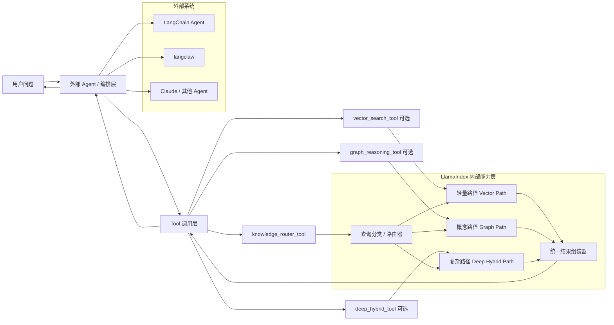
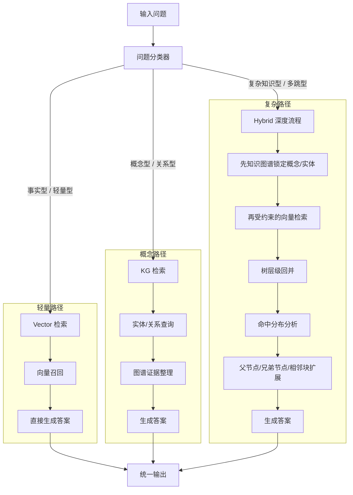
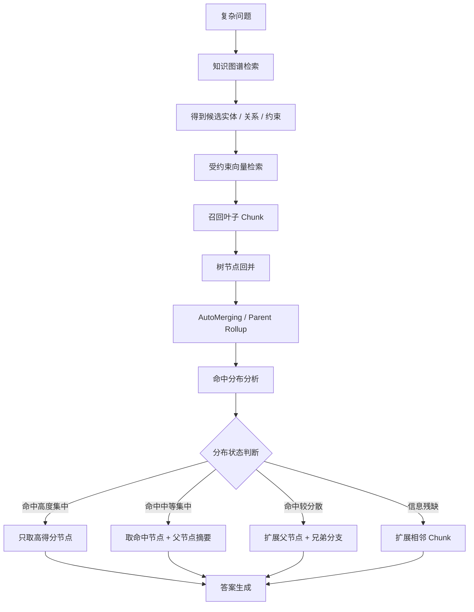
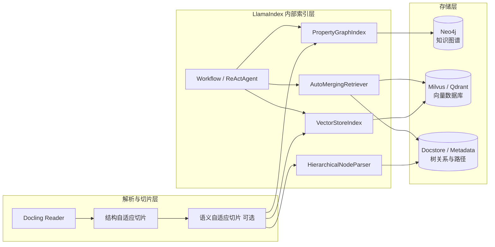
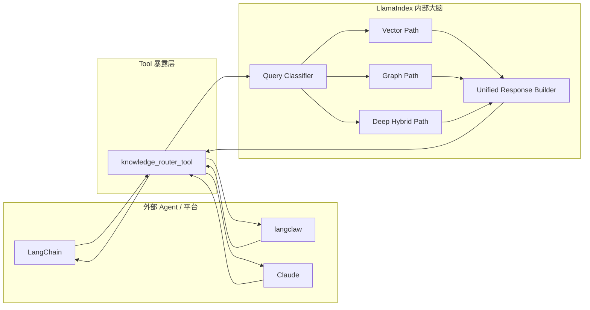

# LlamaIndex 作为 Tool / 子模块的集成架构图

生成时间：2026-05-08  
用途：说明如何把 **LlamaIndex 作为内部能力层**，对外暴露成 Tool，供 **LangChain / langclaw / Claude / 其他 Agent** 调用。

---

## 一、核心结论

这套方案的核心思想不是让 LangChain 或 langclaw 自己负责复杂检索逻辑，
而是：

- **外部 Agent 只负责调用 Tool**
- **LlamaIndex 负责内部检索与路由逻辑**
- **复杂策略（KG → Vec → Tree → 命中分布 → 扩展）全部封在 LlamaIndex 内部**

一句话总结：

> **外部 Agent 只管问，LlamaIndex 内部决定怎么查。**

---

## 二、总架构图：LlamaIndex 作为内部能力层，对外暴露 Tool



### 解释

这个图表达的是：

- LangChain / langclaw / Claude 都可以成为**外部调用方**
- 它们不需要知道内部用了 KG、Vec、Tree 还是 Hybrid 流程
- 它们只调用一个或多个 Tool
- Tool 的内部由 LlamaIndex 决定如何路由和检索

---

## 三、内部决策图：三种问题走三条路径



### 解释

这个图是最重要的，因为它把你想要的**三种问题类型**拆出来了：

1. **轻量问题** → 直接走向量数据库
2. **概念/关系问题** → 直接走知识图谱
3. **复杂知识问题** → 走完整的 Hybrid 深度流程

也就是说，外部 Tool 看起来可能只有一个，
但内部实际上已经有三条不同的处理管线。

---

## 四、复杂路径细化图：KG → Vec → Tree → 聚合 → 扩展



### 解释

这是你最关心的那条主链：

1. **先知识图谱**：缩小概念范围、锁定实体和关系
2. **再向量检索**：但不是全库检索，而是**受约束的向量检索**
3. **再树回并**：把多个叶子 Chunk 向上合并到父节点
4. **再分布分析**：判断命中是集中还是分散
5. **最后扩展**：决定取父节点、兄弟节点还是相邻 Chunk

这条链代表的是：

> **LlamaIndex 不只是检索器，而是完整的检索决策引擎。**

---

## 五、存储层图：LlamaIndex 不是数据库，而是协调 KG / Vec / Tree



### 解释

这个图强调一个关键点：

**LlamaIndex 不是数据库本身，而是编排和协调层。**

它负责：
- 把文档解析后的内容送进 KG / Vec / Tree 三层
- 在查询时把三层索引串起来
- 把 Workflow / Agent 的控制逻辑放在索引之上

也就是说：

- **Neo4j** 负责知识图谱
- **Milvus / Qdrant** 负责向量检索
- **Docstore / Metadata** 负责树关系和路径信息
- **LlamaIndex** 负责把这些组合成可用的能力

---

## 六、对外接入图：langclaw / LangChain / Claude 怎么调



### 解释

这个图表达的是你刚才的那个问题：

> 我把 LlamaIndex 内部逻辑设计好，然后把它包装成 Tool，LangChain / langclaw / Claude 来调用，是否可行？

答案是：**完全可行。**

调用关系就是：

- 外部系统发问题
- Tool 调用 LlamaIndex 内部大脑
- 内部决定走 Vector / Graph / Deep Hybrid 哪条路径
- 最后统一返回结果

---

## 七、推荐的对外暴露方式

### 方案 A：一个总工具（推荐）

```text
knowledge_router_tool(query, context?) -> structured result
```

#### 优点
- 外部 Agent 最简单
- 路由逻辑都藏在内部
- 更适合复杂策略系统

#### 缺点
- Tool 本身会比较重
- 调试时不如拆分工具直观

---

### 方案 B：多个工具（备选）

```text
vector_search_tool(query)
graph_reasoning_tool(query)
deep_hybrid_tool(query)
```

#### 优点
- 调试更清晰
- 不同类型查询可显式调用不同工具

#### 缺点
- 外部 Agent 还要学会“什么时候用哪个工具”
- 对 LangChain / Claude 的提示词要求更高

---

## 八、推荐的结果返回结构

建议对外不要只返回纯文本，而是返回**结构化 JSON / dict**，便于外部 Agent 二次处理。

### 推荐结构

```json
{
  "route": "deep_hybrid",
  "confidence": 0.87,
  "answer": "……",
  "evidence": [
    {
      "source_type": "vector_chunk",
      "doc_id": "doc_1",
      "page": 12,
      "heading_path": "第3章 > 风险控制 > 指标定义"
    },
    {
      "source_type": "graph_relation",
      "entity": "风险敞口",
      "relation": "depends_on",
      "target": "授信额度"
    }
  ],
  "expansion_trace": [
    "kg_lookup",
    "vector_filtered_by_entities",
    "tree_parent_merge",
    "expand_sibling_branch"
  ]
}
```

### 为什么推荐结构化返回

因为外部 Agent 可能需要：
- 再次总结答案
- 选择引用证据
- 展示路径追踪
- 决定是否追问

如果只有纯文本，后续处理会更困难。

---

## 九、最终推荐方案

### 最终建议

> **把 LlamaIndex 做成“内部大脑”，对外暴露为一个总 Tool。**

### 推荐组合

- **内部**：LlamaIndex
  - Query Classifier
  - Vector Path
  - Graph Path
  - Deep Hybrid Path
  - Unified Response Builder

- **对外**：一个 Tool
  - `knowledge_router_tool`

- **调用方**：
  - LangChain
  - langclaw
  - Claude
  - 其他 Agent

### 为什么推荐这个方案

因为它能做到：

1. **对外简单**：外部只调用 Tool
2. **内部复杂**：复杂策略都封装在 LlamaIndex 内部
3. **可演进**：以后你可以继续替换内部逻辑，而不影响外部接口

---

## 十、最后一句话总结

这套图的本质不是：

- 让 LangChain 或 langclaw 负责复杂检索

而是：

- **让 LangChain / langclaw / Claude 只负责调用 Tool**
- **让 LlamaIndex 成为真正的内部检索决策层**

也就是：

> **外部 Agent 不需要知道你内部怎么查，它只需要知道“调用这个 Tool 能得到结构化结果”。**