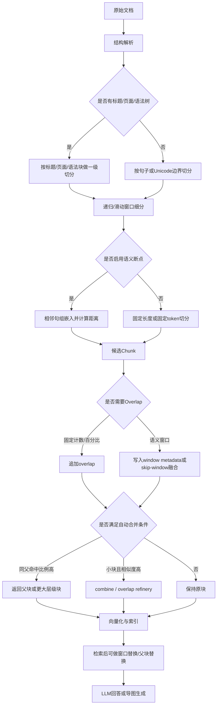

# 切片策略对比与思维导图工作流建议

生成时间：2026-05-08  
来源：deep-research-report (2).md（最新研究报告）

---

## 一、新报告的核心发现：Chonkie 项目

### Chonkie：专门做 Chunking 的新项目

**核验发现**：`github.com/chonkie-inc/chonkie`
- 定位：dedicated chunking framework（不是通用 RAG 框架）
- 许可：MIT
- 最新版本：v1.6.5（2026-05-06，持续活跃）

**核心能力**：
- 多种 chunker：`TokenChunker`、`SentenceChunker`、`RecursiveChunker`、`SemanticChunker`、`LateChunker`、`NeuralChunker`、`SlumberChunker`
- OverlapRefinery：基于上下文/相似度做后处理（不只是固定重叠）
- Pipeline 模式：`.chunk_with("recursive").chunk_with("semantic").refine_with("overlap")`

**配置示例**：
```python
from chonkie import Pipeline

pipe = (
    Pipeline()
    .chunk_with("recursive", tokenizer="gpt2", chunk_size=2048, recipe="markdown")
    .chunk_with("semantic", chunk_size=512)
    .refine_with("overlap", context_size=128)
    .refine_with("embeddings", embedding_model="sentence-transformers/all-MiniLM-L6-v2")
)
```

**核验判断**：
- Chonkie 是目前最完整的 chunking-only 解决方案
- 但它只负责切片，不负责 KG/Vec/Tree/Agent
- 对你方案的影响：可作为 Parse层的一个备选组件

---

## 二、切片能力详细对比（新报告核验）

### 开源框架切片能力矩阵

| 平台 | 语义切片与递归分段 | overlap / 合并逻辑 | 严格字数/Token 限制 | 综合评分 |
|---|---|---|---|---|
| **LlamaIndex** | SemanticSplitter（embedding断点）+ HierarchicalNodeParser + SemanticDoubleMerging | SentenceWindowNodeParser（metadata）+ AutoMergingRetriever（父块回并） | 默认1024 token + 可配 tokenizer | **9.2** |
| **Chonkie** | SemanticChunker（Savitzky-Golay smoothing）+ LateChunker + NeuralChunker + SlumberChunker | OverlapRefinery（相似度后处理）+ skip-window merging | 多 tokenizer（tiktoken/HF/custom）| **9.0** |
| **Haystack** | HierarchicalDocumentSplitter（层级树）+ embedding语义切片仍在 roadmap | AutoMergingRetriever（命中阈值回并父块） | 层级 block size 可控，但不如 Chonkie/Bedrock 的严格 token cap | **7.4** |
| **LangChain** | RecursiveCharacterTextSplitter（分隔符递归）+ SemanticChunker（实验路线） | 固定 chunk_overlap，无父块回并机制 | chunk_size/chunk_overlap + 自定义 length_function | **7.8** |
| **semantic-text-splitter** | 结构感知（sentence/paragraph/heading/tree-sitter），不是 embedding 语义 | 不强调检索后回并，偏"切时少破坏语义" | 最强项：固定容量或范围（500..2000） | **7.2** |

### 托管平台切片能力

| 平台 | 语义切片 | overlap / 合并 | 严格 token 控制 | 适合场景 |
|---|---|---|---|---|
| **Amazon Bedrock KB** | SEMANTIC/HIERARCHICAL/FIXED_SIZE 三路 + maxTokens/bufferSize/breakpointPercentileThreshold | overlapPercentage（fixed）+ 双层块（hierarchical）+ 自定义 Lambda chunker | 全部围绕 token 配置，直接对接模型上下文 | AWS 内部闭环，企业托管 |
| **Azure AI Search** | Document Layout skill（结构识别）+ Text Split skill（token/字符）+ markdownHeaderDepth | pageOverlapLength（固定）+ 布局层保留图像邻近 | maximumPageLength + unit=characters|azureOpenAITokens + encoderModelName | Azure 体系内检索，结构化文档 |
| **Unstructured UI/API** | by_similarity（sentence-transformers）+ contextual chunking（重写补上下文）+ by_title/by_page | overlap/overlap_all/combine_under_n_chars | max_characters/new_after_n_chars（字符软上限） | 复杂文档解析，表格图像多 |

---

## 三、关键技术发现：overlap 与自动合并

### 新报告的核心判断

**overlap 的分水岭不在"能不能切"，而在**：
1. **断点如何生成**（embedding 相似度 vs 固定分隔符）
2. **oversized chunk 如何递归回退**（层级树回并）
3. **检索后如何把碎片重新拼回可回答的上下文**（父块回并）

### 三种代表性路线

| 路线 | 代表项目 | 核心机制 | 适合场景 |
|---|---|---|---|
| **embedding 断点 + 父子回溯** | LlamaIndex SemanticSplitter + AutoMergingRetriever | 相似度下降断点 + 命中阈值自动回父块 | 检索期动态回并，问答场景 |
| **层级树 + 命中阈值回并** | Haystack HierarchicalDocumentSplitter + AutoMergingRetriever | 层级树构建 + 同父命中比例超阈值回父块 | 长文多段答案场景 |
| **相似度平滑 + 相邻块语义融合** | Chonkie SemanticChunker + OverlapRefinery | Savitzky-Golay smoothing + skip-window 融合 | 语义连贯性优先场景 |

### overlap 流程图（新报告核验）



---

## 四、与你方案的集成建议

### Parse层（切片）的选择判断

**基于新报告核验的推荐优先级**：

#### 第一优先：LlamaIndex SemanticSplitter（已验证可行）
- ✅ 原生集成到你选的 LlamaIndex-first 方案
- ✅ 语义自适应（embedding 相似度断点）
- ✅ 与 HierarchicalNodeParser 兼容
- ⚠️ 元数据需手动传播（page_no/heading_path）
- **改动量**：30-50行

#### 第二优先：Docling HybridChunker（结构自适应）
- ✅ 自动保留 page_no + headings
- ✅ 结构自适应（标题层级边界）
- ✅ 与 LlamaIndex 集成（DoclingNodeParser）
- ⚠️ 不是语义自适应（结构优先）
- **改动量**：20-30行

#### 第三优先：Chonkie（新发现，需评估）
- ✅ 最完整的 chunking-only 解决方案
- ✅ SemanticChunker + OverlapRefinery
- ⚠️ 与 LlamaIndex 无原生集成（需自研 adapter）
- ⚠️ 不负责 KG/Vec/Tree/Agent
- **改动量**：100-150行（adapter + pipeline集成）

**核验判断**：
- Chonkie 能力强，但与你 LlamaIndex-first 方案的集成成本较高
- LlamaIndex SemanticSplitter 已经满足你的语义自适应需求
- Docling HybridChunker 已经满足你的元数据保留需求
- **不建议**：为 Chonkie 再增加 100-150行改动（ROI 不高）

---

## 五、托管平台选项（如果你考虑企业托管）

### Bedrock vs Azure vs Unstructured 对比

| 维度 | Bedrock KB | Azure AI Search | Unstructured |
|---|---|---|---|
| **切片能力** | SEMANTIC/HIERARCHICAL/FIXED_SIZE | 结构识别 + token切分 | by_similarity + contextual chunking |
| **与你方案的兼容性** | ❌ 无 KG/Tree/Agent 能力 | ❌ 无 KG/Tree/Agent | ❌ 无 KG/Tree/Agent |
| **适合场景** | AWS 内部闭环 | Azure 体系内检索 | 复杂文档解析 |
| **是否推荐** | 不推荐（缺失你的核心需求） | 不推荐 | 可作为 Parse层备选 |

**核验判断**：
- 托管平台的切片能力虽然强，但都不支持你的 KG+Tree+Agent 核心需求
- 如果你要企业托管切片，可以外接 Unstructured 或 Bedrock
- 但**仍需要 LlamaIndex/KAG 做你的 KG+Tree+Agent 主底座**

---

## 六、思维导图生成工作流（新报告建议）

### 新报告的推荐架构

**开源优先栈**：
```
LlamaIndex/Chonkie/semantic-text-splitter（切片）→
Dify/Flowise/Langflow/n8n（编排）→
markmap/Mermaid/SimpleMindMap（导图渲染）
```

**托管优先栈**：
```
Unstructured/Azure AI Search/Bedrock KB（解析+切片）→
Dify/n8n（编排）→
XMind AI/Mermaid Chart（导图生成）
```

### 可行的全自动工作流形态

**固定模式**（新报告建议）：
```
触发器 → 文档解析 → 一级结构切分 → 二级语义切分 → 
overlap/合并后处理 → 向量化/索引 → 
LLM生成层级大纲 → mindmap render/export → 增量更新
```

### 思维导图渲染器对比

| 名称 | 输入格式 | 导出格式 | 交互编辑 | 适合场景 |
|---|---|---|---|---|
| **markmap** | Markdown 标题/列表 | HTML/SVG/PNG | 可折叠/展开 | 文本源驱动，增量重渲染 |
| **Mermaid** | Mermaid mindmap DSL | SVG/PNG/PDF/MMD | 文本改动即重绘 | 流程图+导图，AI生成 |
| **SimpleMindMap** | JSON/XMind/Markdown | PNG/SVG/PDF/JSON/XMind | 强交互、增量更新 | 浏览器内交互修改 |
| **XMind AI** | 文本/链接/文件 | PNG/SVG/PDF/Excel/Word 等 | 强交互编辑 | 长文直接转导图，商业产品 |

---

## 七、对你方案的影响判断

### Parse层（切片）是否需要更新？

**核验结论**：
- ✅ 新报告提供了更详细的对比（Chonkie/Haystack/托管平台）
- ✅ LlamaIndex SemanticSplitter 的配置示例更明确
- ⚠️ 但你之前的技术判断仍有效：
  - LlamaIndex SemanticSplitter 已满足语义自适应
  - Docling HybridChunker 已满足元数据保留
  - Chonkie 虽强，但集成成本高（ROI 不高）

**更新建议**：
- 保持 LlamaIndex SemanticSplitter + Docling HybridChunker 的推荐方案
- 把 Chonkie 作为备选参考（如需更强的 chunking-only 能力）
- 把托管平台作为企业部署选项（如需外接）

### 思维导图生成是否需要纳入？

**核验发现**：
- 新报告强调："开源导图库不是'从长文自动理解并生成脑图'"
- 真正的自动化是：chunking → LLM大纲抽取 → 导图渲染

**与你方案的关系**：
- 思维导图生成在你当前需求中**不是核心项**
- 你核心需求：KG+Vec+Tree + Agent 自主扩展
- 思维导图可以作为**后置功能**（可视化命中分布）

**建议**：
- 暂不纳入思维导图生成到主实施路径
- 可作为 PoC 后的可视化增强功能
- 用 markmap 或 Mermaid 渲染命中分布树

---

## 八、关键纠正总结

### 对"自适应切片"的补充理解

**之前判断**：
- LlamaIndex 有语义自适应（SemanticSplitter）
- Docling 有结构自适应（HybridChunker）

**新报告补充**：
- Chonkie 有更多切片路线（LateChunker/NeuralChunker/SlumberChunker）
- Haystack 有层级树切片（HierarchicalDocumentSplitter）
- semantic-text-splitter 有结构感知切片（tree-sitter）

### 对"overlap 与合并"的补充理解

**之前判断**：
- AutoMergingRetriever 已实现父块回并

**新报告补充**：
- overlap 的分水岭在：断点生成 + 递归回退 + 检索后拼回
- LlamaIndex/Haystack/Chonkie 代表三种不同路线
- 固定 overlap 只解决边界丢上下文，不解决答案跨块分散

### 对"托管平台切片"的判断

**新报告核验**：
- Bedrock/Azure/Unstructured 的切片能力确实强
- 但都不支持 KG+Tree+Agent 能力
- 如果用托管切片，仍需外接 KG+Tree+Agent 框架

---

## 九、最终推荐方案（基于新报告核验）

### Parse层（切片）推荐方案

**主推荐**：LlamaIndex SemanticSplitter + Docling HybridChunker
- 语义自适应 + 结构自适应双轨
- 元数据自动保留（Docling）
- 与 HierarchicalNodeParser 兼容
- 改动量：20-50行

**备选参考**：Chonkie SemanticChunker
- 如需更强的 chunking-only 能力
- 但需自研 LlamaIndex adapter（100-150行）
- ROI 不高，不优先

### 思维导图生成（后置功能）

**推荐工具**：markmap 或 Mermaid
- 输入：Markdown 大纲（来自 LLM）
- 输出：SVG/HTML/PNG
- 用途：可视化命中分布树

**工作流建议**：
```
命中分布统计 → LLM生成层级大纲 → 
Markdown输出 → markmap渲染 → 可视化导图
```

---

## 十、文档更新说明

**这个文档整合了**：
1. 新报告中的切片能力详细对比
2. Chonkie 项目的核心能力
3. 托管平台的切片能力
4. overlap 与自动合并的三种路线
5. 思维导图生成的工作流建议

**保存理由**：
- 新报告提供了更全面的切片策略对比
- 补充了你之前核验中缺失的项目（Chonkie/semantic-text-splitter）
- 提供了托管平台选项（如需企业部署）
- 但保持了之前的技术判断和推荐方案（LlamaIndex-first）

**与你当前方案的兼容性**：
- 不改变你 LlamaIndex-first 的主决策
- 不改变你 Parse层的推荐方案（SemanticSplitter + Docling）
- 提供了备选参考（Chonkie）和后置功能（思维导图）
- 保持改动量估算不变（1020-1750行）