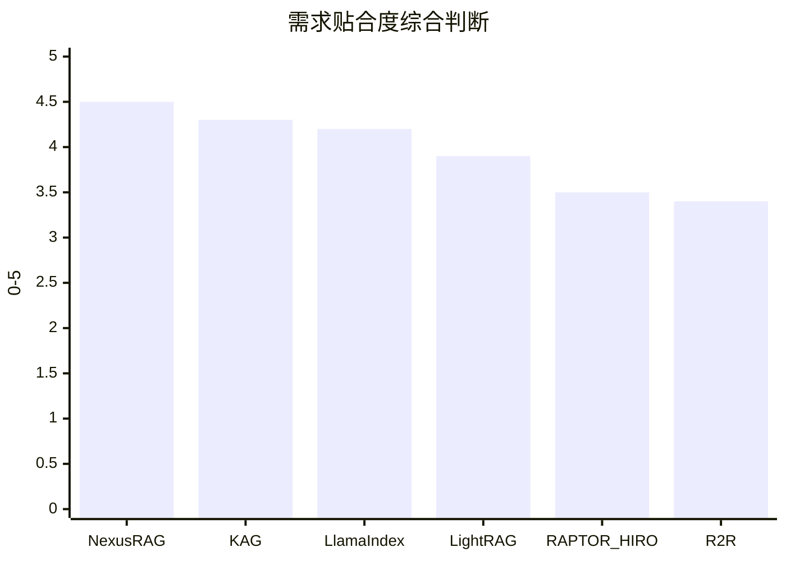
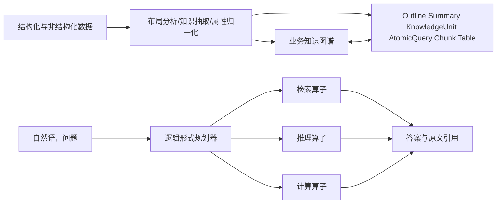
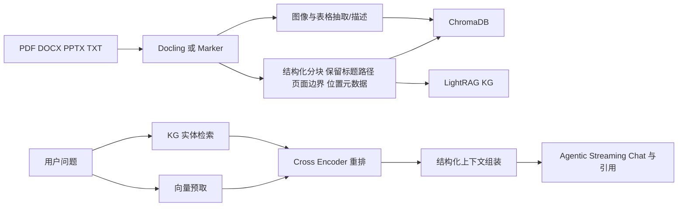
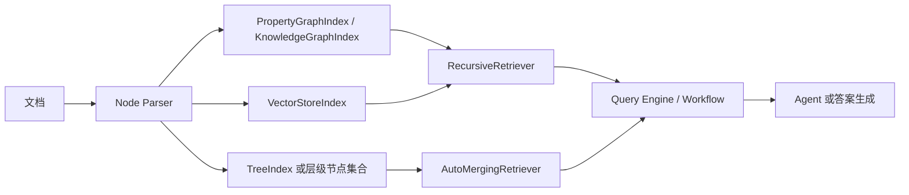
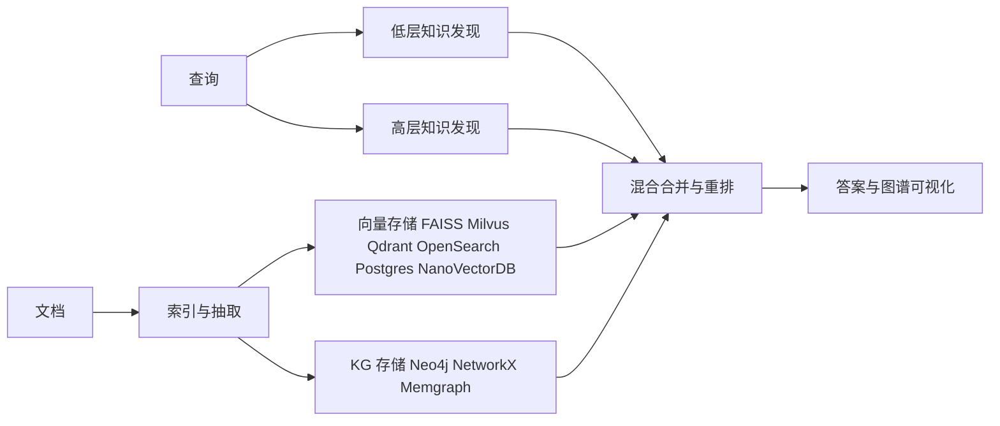
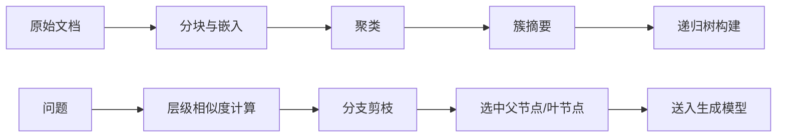
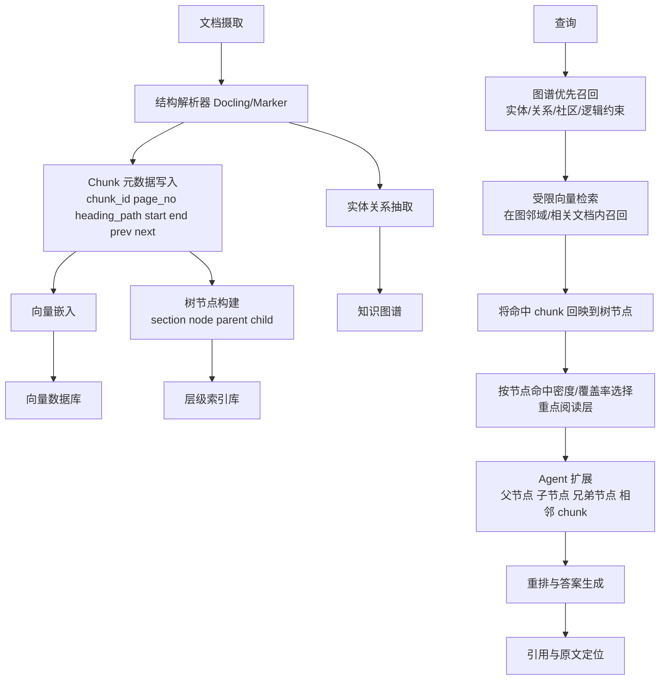

# 排除 GraphRAG 后的混合 RAG 开源项目深度研究

## 执行摘要

基于以 entity["company","GitHub","software hosting platform"] 为起点的多轮仓库检索，以及对项目 README、提交历史、官方文档与原始论文的交叉核对，我得到的核心结论是：**截至 2026 年 5 月，没有单个开源仓库能够“明确且完整”同时覆盖你定义的 A-F 六项能力**。最接近“开箱即用”的是 **NexusRAG**，因为它已经把知识图谱、向量检索、文档结构层级、重排、引用与 Agent 式交互串成一条可运行流水线；最接近“专业域推理骨架”的是 **KAG**，因为它明确提供图谱—原文互索引、逻辑形式驱动的混合推理、层级化索引类型和 MCP/Thinker 扩展；最适合“按模块拼成完整系统”的是 **LlamaIndex**，因为它同时具备图索引、向量索引、树索引、递归检索和父节点合并检索等组件。与此对应，**LightRAG** 更像高成熟度的“图+向量”底座，**RAPTOR/HIRO** 更像高质量的“树层级后处理”补件。 citeturn19search0turn33view5turn33view0turn8search0turn25search6turn27search3turn28search3turn31search10turn11view13turn11view14

如果把你的需求拆开来看，**A（知识图谱）+ B（向量数据库）+ D（多阶段检索）** 在现有项目里并不罕见；真正稀缺的是 **C（树状/层级非向量知识库）+ E（向量命中回映到树节点并基于命中分布决定重点阅读）+ F（基于召回节点的树扩展与相邻上下文扩展）** 这一组三连。现有项目里，KAG 在 C 上最强，NexusRAG 在“文档结构树 + 原文位置保留”上最实用，LlamaIndex 在 E 上最接近现成能力，RAPTOR/HIRO 在 C/E 上最纯粹，但它们都需要额外组合，才能逼近你要求的完整形态。 citeturn33view0turn33view4turn19search0turn11view4turn25search6turn27search3turn30search0turn11view14

综合“需求贴合度、可落地性、改造成本”三个维度，我的排序是：**NexusRAG 适合最快做出 POC；KAG 适合专业知识与逻辑推理场景；LlamaIndex 适合自定义完整栈；LightRAG 适合做图+向量核心；RAPTOR/HIRO 适合补树层级后处理**。如果你要的是“非 GraphRAG、但尽可能接近 A-F 的生产方案”，最稳妥的现实答案不是“选单仓库”，而是**选一个图谱核心 + 一个层级索引层 + 一个可编排 Agent/检索框架**。 citeturn19search0turn33view5turn31search10turn8search0turn11view13turn11view14

## 检索范围与判定方法

本次检索严格按你的要求，先从 GitHub 仓库开始，使用多组组合关键词反复检索：`RAG`、`knowledge graph`、`KG`、`graph retrieval`、`vector db`、`FAISS`、`Milvus`、`Weaviate`、`hierarchical index`、`tree index`、`chunk position`、`context expansion`、`agent`、`multi-stage retrieval`、`cascade retrieval`，并且显式排除带有 **GraphRAG** 身份的仓库。被明确排除的 GitHub 仓库包括 **microsoft/graphrag**、**tigergraph/graphrag**、**apecloud/ApeRAG**、**automataIA/graphrag-rs** 等；它们即使部分能力很强，也与“明确排除 GraphRAG”的要求冲突。 citeturn6search2turn6search4turn9search3turn6search5

在排除显式 GraphRAG 项目后，我把命中仓库分成三类。第一类是“**主候选**”：同时命中 KG、向量、层级或其中两项以上，并且仓库有持续维护与可运行代码，例如 KAG、NexusRAG、LightRAG、LlamaIndex、R2R、Cognee、RAPTOR、HIRO、VectorInstitute/kg-rag。第二类是“**边缘候选**”：只明显满足其中两维，例如 **RAGFlow** 偏强在文档结构、模板分块与 Agent，但 README 未明确提供知识图谱构建/查询；**pdichone/knowledge-graph-rag** 明显有 KG + 向量式 RAG，但没有树层级索引；第三类是“**研究旁支**”：如 **HMRAG**、**A-RAG**，强调层级检索或 Agent，但与“KG + 向量 DB + 树状知识库”的三件套仍有缺口。 citeturn21search1turn21search0turn9search7turn9search9

关于 A-F 的判定，我采用了相对严格的标准。A、B、D 只要 README、代码目录或官方文档明确出现，即判为“是”；C 只有在仓库提供**显式树索引/层级索引**，或至少稳定保留**可维护的 heading/path/page 层级结构**时才判为“是”或“部分”；E 必须看到“向量命中—父节点/层级节点回映、聚合、合并、重点阅读”等后处理机制，才判为“是”；F 必须看到**自主扩展逻辑**而不是单纯聊天 Agent 或工作流。凡公开材料没有明确写出的，一律标为“未说明”。这也是为什么本轮检索里没有“全满分项目”。  

下面的综合贴合度图，是我基于 A-F 六维、开箱能力与成熟度做出的**研究判断**，更适合帮助你快速缩小范围，而不是替代源码审阅。

这个排序的依据是：NexusRAG 已经把结构化文档树、KG、向量库、重排、引用和 Agent 交互串在一起；KAG 在专业域 KG 推理和多索引层面更强；LlamaIndex 虽然不是开箱整机，但模块覆盖最完整；LightRAG 的图+向量基础设施最强；RAPTOR/HIRO 则补足树层级检索与后处理；R2R 在图谱与 Agent 上成熟，但层级树能力弱。 citeturn19search0turn33view5turn33view0turn8search0turn25search6turn27search3turn31search10turn11view13turn11view14turn42search0turn42search7

## GitHub 候选项目比较

### 候选项目总表

| 项目 | GitHub仓库 | 最新提交/更新 | A | B | C | D | E | F | 端到端开箱 | 可模块拼接 | 成熟度 |
|---|---|---:|---|---|---|---|---|---|---|---|---|
| KAG | KAG citeturn10view0turn13view0turn12search3turn33view5turn33view0 | 2026-01-28 | 是 | 未说明 | 是 | 是 | 部分 | 部分 | 基本可用 | 强 | 4：索引层级与推理强，但工程配置偏重 |
| NexusRAG | NexusRAG citeturn19search0turn20search0turn11view4turn11view3turn38view0 | 2026-04-19（GitHub Updated） | 是 | 是 | 是 | 是 | 部分 | 部分 | 是 | 中 | 4：年轻但完整度高 |
| LlamaIndex | llama_index citeturn8search0turn12search0turn25search6turn27search3turn28search3turn28search4 | 2026-04-16 | 是 | 是 | 是 | 可拼接 | 是 | 可拼接 | 否 | 极强 | 5：最成熟的拼装底座 |
| LightRAG | LightRAG citeturn15view0turn39view2turn35view5turn35view0turn31search10 | 2026-04-29 | 是 | 是 | 部分 | 是 | 未说明 | 未说明 | 是 | 强 | 5：图+向量能力最完整 |
| RAPTOR | raptor citeturn16view2turn36view0turn11view13turn30search0 | 2024-09-03 | 否 | 是 | 是 | 是 | 是 | 否 | 否 | 中 | 3：树检索强，但无 KG |
| HIRO | hiro citeturn16view3turn11view14 | 2024-08-20 | 否 | 是 | 是 | 是 | 是 | 否 | 否 | 中 | 2：更像 RAPTOR 的查询优化层 |
| R2R | R2R citeturn16view0turn41view3turn42search0turn42search1turn42search7 | 2025-11-07 | 是 | 是 | 部分 | 部分 | 未说明 | 部分 | 是 | 中 | 4：API/Agent 完整，树层级薄弱 |
| Cognee | cognee citeturn16view1turn7search0turn37view2turn39view1 | 2026-04-24 | 是 | 是 | 未说明 | 未说明 | 未说明 | 部分 | 是 | 中 | 4：Agent memory 很强，但非树检索系统 |
| kg-rag | kg-rag citeturn16view4turn11view15turn37view0turn9search1 | 2025-11-24 | 是 | 是 | 否 | 部分 | 未说明 | 否 | 研究代码 | 中 | 3：研究型框架，层级主要落在被排除的 GraphRAG 分支 |

从这个对比表可以直接看出两件事。第一，**NexusRAG、KAG、LlamaIndex** 是本轮最值得优先读源码的三条线，但它们“接近”的原因并不一样：NexusRAG 靠现成系统完整性，KAG 靠多索引与逻辑推理，LlamaIndex 靠模块可组合性。第二，**E/F 这两项是当前开源生态最缺的部分**：公开材料里明确实现“向量命中回映树节点并按命中分布安排重点阅读”的项目非常少，明确实现“Agent 按召回树节点和原文相邻位置自主扩展”的项目也几乎没有成品。 citeturn19search0turn33view5turn25search6turn27search3turn11view13turn11view14

### 仓库元数据与关键路径

| 项目 | 主要语言 | 关键模块文件/路径 | README 相关说明与示例/演示 | 向量库与图数据库 | 许可 |
|---|---|---|---|---|---|
| KAG citeturn10view0turn12search3turn33view0turn33view4 | Python | `kag/`、`knext/`、`docs/`、`tests/` | README 明确写出 mutual indexing、逻辑形式引导的混合推理；0.8 版新增 `Outline/Summary/KnowledgeUnit/AtomicQuery/Chunk/Table` 索引与 MCP/KAG-Thinker 能力 | 图谱基于 OpenSPG；向量检索存在，但仓库未明确具体向量 DB 后端 | Apache-2.0 |
| NexusRAG citeturn19search0turn38view0turn11view4 | Python / TypeScript 前端 | `backend/app/api`、`backend/app/services`、`backend/app/core`、`frontend/`、`mcp-server/` | README 有完整架构、Docker 启动、`demo_nexus_video_compressed.mp4`、SSE Agent 时间线、内联引用 | 向量为 ChromaDB；图谱为 LightRAG file-based KG（`NetworkX + NanoVectorDB`） | MIT |
| LlamaIndex citeturn12search1turn25search6turn27search3turn28search3turn28search5 | Python | `llama-index-core/`、`llama-index-integrations/`、`docs/examples/retrievers/` | 例子覆盖 `recursive_retriever_nodes.ipynb`、composable retrievers、PropertyGraph/Neo4j 等 | 向量后端极多；图侧有 `PropertyGraphIndex` 与 `Neo4jPropertyGraphStore` | MIT |
| LightRAG citeturn37view3turn39view2turn35view5turn35view1 | Python | `lightrag/kg/`、`lightrag/lightrag.py`、`lightrag/operate.py`、`lightrag/rerank.py`、`examples/`、`lightrag_webui/` | README 提供 server/core 双入口、视频 demo、Web UI 图谱可视化、`examples/lightrag_openai_demo.py` | `faiss_impl.py`、`milvus_impl.py`、`qdrant_impl.py`、`opensearch_impl.py`、`postgres_impl.py`、`neo4j_impl.py`、`networkx_impl.py` | MIT |
| RAPTOR citeturn36view0turn11view13 | Python | `raptor/FaissRetriever.py`、`cluster_tree_builder.py`、`tree_retriever.py`、`tree_builder.py`、`tree_structures.py` | README + `demo.ipynb` 明确围绕树构建与树检索；官方论文链接齐全 | `FaissRetriever.py` 明确指向 FAISS；无图数据库 | MIT |
| HIRO citeturn14view5turn11view14 | Python | `raptor/`、`demo.ipynb`、`requirements.txt` | README 明确写“recursive similarity scoring and branch pruning”，本质是 RAPTOR 的查询优化层 | 继承 RAPTOR 的向量树检索；无图数据库 | MIT |
| R2R citeturn37view1turn41view3turn42search0turn42search1 | Python | `py/core/`、`py/r2r/`、`sdk/`、`services/`、`deployment/k8s/` | README 有 demo 视频与客户端 API；官方文档独立提供 Graphs、Retrieval、Collections cookbook | 文档提及向量搜索与图搜索并用；社区图谱支持 entities/relationships/communities，底层存储在公开片段中未完全展开 | MIT |
| Cognee citeturn37view2turn39view1turn7search0 | Python / TypeScript | `cognee/infrastructure/databases`、`memory/`、`modules/`、`pipelines/`、`memify_pipelines/` | README 提供 `remember/recall/forget/improve`、Claude/Hermes agent 插件、examples | README 明确是 graph/vector search；具体后端在基础设施目录，公开片段未完整枚举 | Apache-2.0 |
| kg-rag citeturn37view0turn11view15turn9search1 | Python | `kg_rag/methods/`、`configs/`、`evaluation/`、`utils/` | README 明确列出 baseline vector、entity-based、Cypher-based、GraphRAG-based 分支 | 图数据库明确为 Neo4j；向量 baseline 存在，但具体向量库后端未突出 | 自定义许可，见 `LICENSE.md` |

如果只看“仓库成熟度”而不看“对你需求的贴合度”，LlamaIndex 和 LightRAG 其实最稳；如果只看“最像你想要的系统轮廓”，则是 NexusRAG 与 KAG；如果只看“树状层级知识库/索引”的纯度，RAPTOR/HIRO 反而更明确。真正的问题不在于哪个项目“最好”，而在于哪个项目最适合当你的**主底座**。 citeturn8search0turn15view0turn19search0turn33view5turn11view13turn11view14

## 最接近需求的项目深度分析

下面我选择 **KAG、NexusRAG、LlamaIndex、LightRAG、RAPTOR/HIRO** 五条线做深入分析。原因很简单：这五条线几乎覆盖了你要的全部能力，只是分布在不同层面上——KAG 偏推理和多索引，NexusRAG 偏结构保留和端到端，LlamaIndex 偏拼装能力，LightRAG 偏图+向量核心，RAPTOR/HIRO 偏层级树检索与重点阅读。 citeturn33view5turn19search0turn25search6turn31search10turn11view13turn11view14

**KAG：最强的知识图谱语义骨架，但向量后端需要你自己补强。**

KAG 的公开材料最打动人的地方，不是“它有图谱”，而是**它把图谱和原始文本块做了 mutual indexing**。README 直接写出了 `Knowledge and Chunk Mutual Indexing structure`、`Schema-constrained knowledge construction`、`Logical form-guided hybrid reasoning and retrieval` 三个核心特征；同时又在 0.8 版本里补上了 `Outline`、`Summary`、`KnowledgeUnit`、`AtomicQuery`、`Chunk`、`Table` 这些层级索引类型，并支持 MCP 与 KAG-Thinker。换句话说，它已经具备了“图谱层 + 多类型层级索引层 + 逻辑求解器”的骨架，这在非 GraphRAG 的项目里非常少见。 citeturn33view5turn33view4turn33view0turn33view2turn33view3

从流水线看，KAG 先处理非结构化文本与业务规则，把它们吸收进 DIKW 风格的业务知识图谱，再基于“图结构—原始文本块”互索引建立多层索引。查询侧不是直接丢给 embedding 检索，而是先把自然语言转成逻辑形式，再让规划、推理、检索三类算子混合执行；单步执行时可以做精确匹配、文本检索、数值计算或语义推理。这条链路对专业域问答尤其友好，因为它可以把“语义相似”让位给“逻辑相关”。 citeturn33view4turn33view5turn31search1

和你需求比对时，KAG 的 **A/C/D** 基本是强命中；**F** 也有一半，因为它现在已经支持 MCP、KAG-Thinker 和多轮迭代式思考框架。但 **B/E** 还差最后一截：论文与 README 明确谈“vector retrieval”，提交记录也能看到 embedding/vec 相关修复，不过仓库公开材料没有像 LightRAG 那样明确点名 FAISS/Milvus/Qdrant 一类后端；同样，它虽有图文互索引和“linking generated content to original references”，但没有公开讲清楚“将向量命中映射到树节点并按命中分布决定重点阅读”的具体算法。换句话说，KAG 很像你要的**语义主脑**，但不是完整的**检索总装机**。 citeturn33view2turn33view3turn13view0turn31search1

就适配建议而言，如果你的目标场景是金融、法务、政务、医疗、风控这类“**逻辑正确性比召回花哨更重要**”的系统，我会优先把 KAG 作为主底座，然后在它外侧接一个显式向量库与一个显式树层级层。这样做的好处是：图谱建模、逻辑规划、知识对齐都站在 KAG 一侧完成，而“向量召回—树节点回映—相邻扩展”可以留给外部模块，不会污染 KAG 的核心推理链。 citeturn33view5turn33view0

**NexusRAG：离你需求最近的开箱系统，尤其适合做第一版 POC。**

NexusRAG 是本轮检索里**最像“你现在就能跑起来”的答案**。README 已经非常明确：它用 Docling 或 Marker 解析文档，保留 `headings`、`page boundaries`、公式和版面；分块是“hybrid semantic + structural chunking”；每个 chunk 都带 `page number`、`heading path` 和同页图表引用；图谱层使用 LightRAG 做实体抽取和关系建模；向量层使用 ChromaDB；查询时采取“vector over-fetch + KG entity lookup + cross-encoder rerank”的三段式流水线，最后再把 `KG insights → cited chunks → related images/tables` 结构化装配给生成环节。 citeturn19search0turn11view3turn11view4

这意味着它在你的需求上同时打到了几个高价值点。**A** 没问题，知识图谱明确存在；**B** 也清楚，ChromaDB 是现成向量库；**C** 虽然不是独立的“树数据库”，但它保留了可维护的 heading hierarchy、page-aware metadata 和结构化 chunk，足够构成文档级树状索引；**D** 也成立，因为它不是单次召回，而是把 KG 检索、向量检索和 rerank 串成流水线；**F** 虽然没达到你定义的最严格版本，但它已经有 agentic streaming chat、思考面板、MCP server 和多工作区知识库。 citeturn19search0turn38view0

NexusRAG 真正值得你注意的是它对 **E** 的“半实现”状态。它已经把最难丢失的信息——**原文位置**——保留了下来，尤其是 `page number` 与 `heading path`。这意味着你完全可以在其现有 `backend/app/services/` 里补一层聚合逻辑，把“向量命中 chunk”上卷到“heading/path 节点”，再按节点命中密度决定读父节点、兄弟节点还是邻接 chunk。项目 README 还明确写出“Page awareness preserved end-to-end: chunk → citation → document viewer navigation”，这对实现你的“命中回映 + 重点阅读”要求极其关键。它暂时缺的是**分布聚合决策算法**，而不是元数据基础设施。 citeturn19search0turn38view0

它的优点很集中：跑得起来快、结构保留好、引用链完整、POC 友好。短板也很清晰：图谱层目前主要依赖 LightRAG 的 file-based KG，逻辑推理深度不如 KAG；树层级是“文档结构树”而不是单独的层级知识库；Agent 扩展策略停留在交互与流程层，还没有明确做成“图—树—邻接”的自主演进器。对于你这种需求，我会把 NexusRAG 定义成**首选 POC 母体**：只要再补三个模块——图触发向量召回、树节点分数聚合、邻接上下文扩展——它就非常接近你要的系统。 citeturn19search0turn11view4

**LlamaIndex：最适合“把 A-F 真正做全”的工程底座。**

LlamaIndex 的优势不在于 README 会把你的场景直接说出来，而在于它已经把你需要的**构件**都准备好了。Repo 主体由 `llama-index-core`、`llama-index-integrations` 等模块组成；GitHub 讨论和问题里能够明确看到 `KnowledgeGraphIndex`、`PropertyGraphIndex`、`RecursiveRetriever`、`AutoMergingRetriever`、`TreeIndex` 这些类名和相关示例路径；官方讨论还直接给出 `RecursiveRetriever(..., node_dict=all_nodes_dict)` 的使用方式，而与 `AutoMergingRetriever` 相关的 issue 也能看到它如何把 child hit 合并回 parent node。对于“向量命中回映父节点并提升到更高层级阅读”这件事，LlamaIndex 是这轮检索里**最接近现成机制**的项目。 citeturn12search1turn25search6turn27search3turn26search8turn27search4

在 A-F 映射上，LlamaIndex 的 A、B、C 都很强：A 可以用 `KnowledgeGraphIndex` 或 `PropertyGraphIndex`，而且文档讨论里明确展示了 `Neo4jPropertyGraphStore` 的接法；B 是 `VectorStoreIndex` 与大量向量后端集成；C 则可以用 `TreeIndex`，或者直接在 node 级元数据上构造层级父子关系。D 不是默认成品，但 `RecursiveRetriever` 和 composable retrievers 已经说明它能做多阶段路由；E 则是它最亮眼的一点，`AutoMergingRetriever` 的合并语义几乎就是“命中多个子节点后上卷到父节点”；F 还差一个现成模板，但因为 LlamaIndex 还有 Workflows/Agents 体系，所以这个缺口是**最容易通过工程实现补齐**的。 citeturn28search3turn28search4turn25search6turn27search3turn28search5

如果把 LlamaIndex 用在你的需求上，最合理的思路不是“全用它的默认组件”，而是“**拿它做中枢**”。具体做法是：文档解析和 chunk 位置保留借鉴 NexusRAG；图谱抽取可用 LlamaIndex 自己的 `PropertyGraphIndex + Neo4jPropertyGraphStore`，也可对接外部图层；向量检索用 Milvus/Chroma/Qdrant 等后端；层级树用 `TreeIndex` 或自己构造 parent-child node；最后用 `RecursiveRetriever + AutoMergingRetriever + Workflow/Agent` 把检索、回映、扩展串起来。这样你几乎可以把 A-F 全部落在同一个工程框架里。 citeturn28search3turn28search4turn25search6turn27search3

它的缺点也很明确：这不是一个“clone 后 docker compose up”就能直接满足你需求的系统，而是一个**要自己装配的高成熟度工具箱**。但正因为如此，它恰恰非常适合你——你的需求已经明显超出普通 RAG，而进入“研究型产品工程”的层级。对于这种问题，拼装能力通常比单仓库纯完整性更重要。 citeturn8search0turn12search0

**LightRAG：图与向量底座非常强，但树层级不是它的重点。**

LightRAG 的强项非常清楚：**它几乎是本轮里最完整的图+向量底座**。ACL 论文明确把它定义为“integrates graph structures into text indexing and retrieval processes”，并且使用 “dual-level retrieval system” 同时做 low-level 与 high-level knowledge discovery；仓库里的 `lightrag/kg/` 目录直接列出了 `faiss_impl.py`、`milvus_impl.py`、`qdrant_impl.py`、`opensearch_impl.py`、`postgres_impl.py`、`neo4j_impl.py`、`networkx_impl.py`、`memgraph_impl.py` 等适配器，README 也明确写了 Neo4j 存储支持、OpenSearch 统一后端、Web UI 图谱可视化与 `mix mode` + reranker 的推荐用法。 citeturn31search10turn39view2turn34view4turn35view5turn35view0

所以在 A/B/D 上，LightRAG 很强：KG 有，向量库有，多阶段/双层检索有，而且工程成熟度很高。问题在于 **C/E/F 并不是它的主设计目标**。它强调的是 dual-level graph-aware retrieval，而不是文档树或显式树状知识库；它有实体、关系、图谱可视化和混合重排，但没有明确公开“向量命中如何回映到树节点”的机制；它有 server、API 和 multimodal integration，却没有把 Agent 做成“基于树节点与邻接位置的自扩展器”。这使得它非常适合扮演**检索内核**，却不太适合独立承担你的全部需求。 citeturn31search10turn35view5turn35view1

如果你更看重**本地部署简单、后端存储可选、图+向量混合检索性能**，LightRAG 是一个很好的中台。实际工程上，我会把它放在系统中间层：上游接结构化解析器和树层，查询侧再叠加 RAPTOR/HIRO 或 LlamaIndex 的层级聚合。对你而言，LightRAG 最像“世界上最强的半套答案之一”：它把图与向量解决得很好，但不负责把树层和 Agent 自扩展收口。 citeturn39view2turn35view5

**RAPTOR/HIRO：它们不是完整系统，却是补齐树层级与重点阅读最好的组件。**

RAPTOR 的论文和官方仓库都很统一：核心思想是“**递归地聚类、摘要并构造树**”，再在多层抽象级别上做检索。官方仓库的 `raptor/` 目录里可以直接看到 `FaissRetriever.py`、`cluster_tree_builder.py`、`tree_builder.py`、`tree_retriever.py`、`tree_structures.py` 这些文件；而 HIRO 则是在 RAPTOR 之上加入 `recursive similarity scoring and branch pruning` 的查询机制，目的是让树检索更高效、更聚焦。也就是说，这一对组合正好提供了你非常在意的 **C（树层级）** 与相当接近 **E（回映后重点阅读）** 的能力。 citeturn36view0turn11view13turn30search0turn11view14

和你的需求相比，RAPTOR/HIRO 的短板同样明显：它们**没有知识图谱**，也没有开箱 Agent，更没有文档级实体关系查询。但正因为它们聚焦，它们特别适合拿来当“结构后处理层”。最自然的用法是：前面由 KAG、LightRAG、NexusRAG 或 LlamaIndex 完成图谱与初步召回；后面把召回 chunk 组织进树，或者直接对整库预先构树，再结合 HIRO 做分支剪枝与聚焦阅读。这样，E 项里的“依据命中分布决定读哪一层、扩哪一支”就有了非常可靠的算法来源。 citeturn11view13turn11view14

如果你打算做一套真正有“研究感”的混合 RAG，这一组几乎是必看的。因为现在开源生态里，大家都在做图与向量，但**真正把“层级阅读”做成独立研究对象的，还是 RAPTOR/HIRO 这一系更纯粹**。你最终未必直接用它们的全部代码，但它们最值得借走的是“树构建”和“分支剪枝”思想。 citeturn30search0turn11view14

## 模块拼接蓝图

上面的分析已经很清楚地说明：如果想在非 GraphRAG 路线下实现你定义的 A-F，现实可行的方式是**把 KAG/NexusRAG/LightRAG/LlamaIndex/RAPTOR-HIRO 的长项拼起来**。下面这个蓝图，就是我基于这些项目公开能力综合出来的一条最实用路线。它不是某个仓库现成提供的流程，而是一个**可直接工程化的融合架构**。KAG 提供“图谱—文本互索引”和逻辑形式求解，NexusRAG 提供文档结构与原文位置保留，LightRAG 提供图+向量后端适配，LlamaIndex 提供递归路由与父节点合并，RAPTOR/HIRO 提供树层级构建与分支剪枝。 citeturn33view5turn19search0turn39view2turn25search6turn27search3turn11view13turn11view14

真正落地时，第一件必须自研的事是**位置与层级元数据模型**。最小集合建议是：`chunk_id`、`doc_id`、`page_no`、`heading_path`、`section_id`、`parent_section_id`、`start_char`、`end_char`、`prev_chunk_id`、`next_chunk_id`、`tree_node_id`、`graph_entity_ids[]`、`vector_id`。NexusRAG 已经证明 `page number + heading path + image/table references` 能够端到端传到引用与文档查看器；KAG 则证明图结构与原文块之间的 mutual indexing 是可行的。这两者一结合，你就已经拿到了实现 E/F 所需的“血缘信息”。 citeturn19search0turn33view4turn33view5

第二件必须自研的事是**“图触发向量检索”策略**。一个实用做法是：查询先进入图谱检索层，先拿到实体、关系、社区或逻辑约束结果；然后把这些结果转成向量检索的**过滤条件**，例如文档集合、章节集合、实体关联 chunk 集合或社区集合，再让向量库只在这个子空间里召回。R2R 的官方文档已经明确展示“开启 `graph_settings` 后让搜索与 RAG 增强”，KAG 又展示了逻辑形式规划器如何在检索前先组织问题求解过程，所以这一步最合理的实现不是“图和向量并联后 hard merge”，而是“图先约束，再向量精排，再回到树结构聚合”。 citeturn42search0turn42search7turn33view5

第三件关键事是 **“向量命中回映回树节点”**。这里建议直接借鉴 LlamaIndex 的思想：先把每个 chunk 映射到一个树节点，再把命中分数沿祖先链路上卷。一个简单有效的聚合公式可以是：`node_score = Σ(hit_score × depth_weight × coverage_weight)`。其中 `depth_weight` 控制你是更偏细粒度还是更偏父节点概览，`coverage_weight` 则反映该节点有多少子 chunk 被击中。LlamaIndex 的 `AutoMergingRetriever` 已经提供了“当足够多 child 被命中时，合并成 parent”的思路；RAPTOR/HIRO 则进一步告诉你，可以按层级递归打分并做 branch pruning。用这两个思想拼在一起，就能把 E 项真正做落地。 citeturn27search3turn27search7turn11view14turn30search0

第四件事是 **Agent 自主扩展机制**。这里不要把 Agent 做成“随便多搜几次”，而应当做成**受预算约束的结构扩展器**。最实用的顺序是：先向上读父节点摘要，再按 `node_score` 最高的节点向下展开子节点；如果命中节点过于集中，再读取兄弟节点；如果问题是细节核验证，再按 `prev_chunk_id / next_chunk_id` 做相邻扩展。HIRO 的 branch pruning 可以用来控制预算，NexusRAG 的 page-aware chunk metadata 可以保证相邻扩展仍然保持原文位置一致性，而 KAG-Thinker/MCP 能给这层扩展器一个外部调用接口。这样得到的 Agent，不再只是聊天代理，而是一个**懂图谱、懂树、懂原文位置**的结构化阅读器。 citeturn11view14turn19search0turn33view2turn33view3

## 实施建议

如果你的目标是**最短时间做出一个接近需求的系统**，我的优先选项是 **NexusRAG**。理由不是它在逻辑推理上最强，而是它已经具备了图谱、向量库、结构化 chunk、页码/标题路径、重排、引用与 Agent 交互，离 A-F 只差三块自研补丁：图优先触发向量检索、树节点回映聚合、相邻 chunk 扩展。这个路线最适合第一版验证，因为你不需要先解决“位置信息如何保存”这种底层问题。 citeturn19search0turn11view4

如果你的目标是**专业域生产系统**，尤其强调“多跳事实问答、逻辑推理、专业规则、图谱语义边界”，我的优先选项会切换成 **KAG 作为主脑 + 外接显式向量库 + 外接树层级模块**。原因是 KAG 在公开材料里对“图谱—原文互索引”和“逻辑形式混合求解”描述得最完整，也已经引入了 MCP 与 KAG-Thinker；它不完美的地方主要是向量后端和树回映算法没有完整公开，而不是主干思路不够。这个路线的难点在于工程整合，但上限最高。 citeturn33view5turn33view0turn31search1

如果你的目标是**构建一个长期可维护的平台层**，而不是尽快上线单一应用，那么我会优先推荐 **LlamaIndex 组合栈**。它不像 NexusRAG 那样现成，也不像 KAG 那样强烈绑定某种知识建模范式，但它能把你需要的 A-E 做成相对干净的模块边界：PropertyGraph/KnowledgeGraph 负责图层，VectorStore 负责向量层，TreeIndex 与层级 node 负责树层，RecursiveRetriever/AutoMergingRetriever 负责后处理，Workflow/Agent 负责 F。对愿意自己写代码的团队来说，这是最平衡的一条路。 citeturn28search3turn28search4turn25search6turn27search3

下面给出一个**粗略工程量估算**。这部分是基于仓库完整度、需要补的自研模块数量和系统耦合复杂度做的判断，不是仓库官方承诺：

| 路线 | 粗略人日 | 适合场景 | 需要自研的关键模块 |
|---|---:|---|---|
| NexusRAG 增量改造 | 5-10 人日 | 快速 POC / 内部验证 | 图优先约束、树节点聚合、邻接扩展 |
| LlamaIndex 组合实现 | 15-25 人日 | 平台化建设 / 可维护中台 | 结构 parser 接入、图向量路由、Agent 控制器、评测管线 |
| KAG 增强实现 | 20-35 人日 | 专业域问答 / 逻辑推理 | 外部向量 DB 适配、树层级索引、E/F 扩展逻辑 |
| KAG + RAPTOR/HIRO + 向量库 全量方案 | 35-60 人日 | 高要求生产系统 | 树构建调度、分支剪枝、图树联合缓存、可观测性与评测 |

真正必须自研、而且绕不过去的模块，我建议你优先排四个。第一，**chunk 到原文位置的稳定映射层**；第二，**图谱约束触发向量召回的路由器**；第三，**命中 chunk 到树节点的聚合与重点阅读策略**；第四，**预算受控的 Agent 扩展器**。如果这四块做扎实，底座选 KAG、NexusRAG 还是 LlamaIndex，差别就会从“能不能做”变成“做起来哪种更顺手”。结合本轮研究，我给出的最终执行顺序是：**先用 NexusRAG 做验证，再决定是向 KAG 靠拢提升专业推理，还是向 LlamaIndex 靠拢做长期平台化；LightRAG 与 RAPTOR/HIRO 则作为中间层能力被吸收进来。** citeturn19search0turn33view5turn31search10turn11view13turn11view14turn8search0