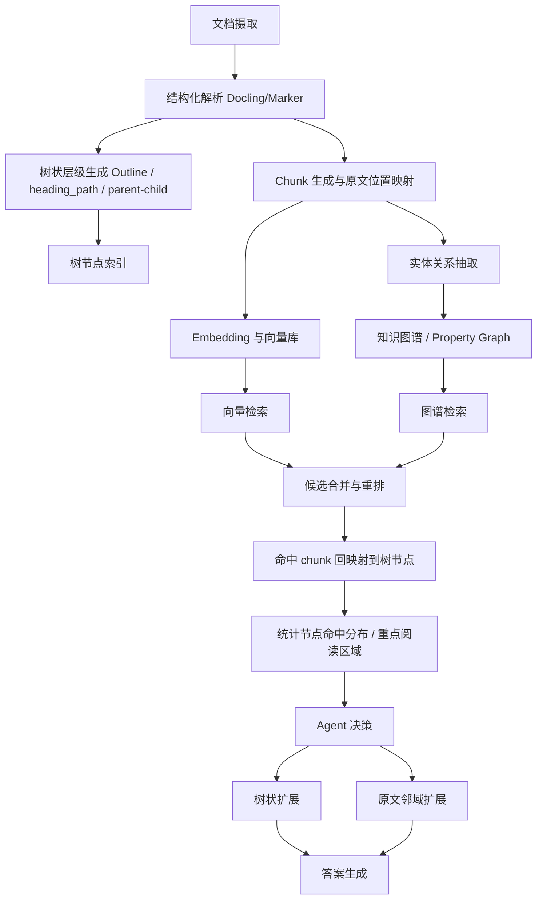
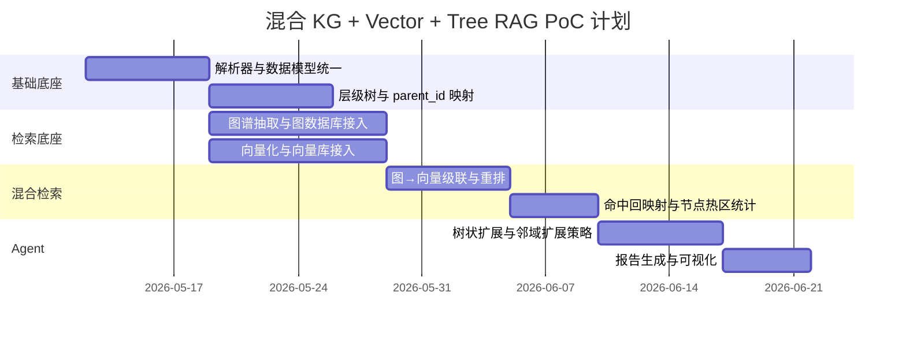

# GitHub 开源平台上知识图谱、向量数据库与树状层级知识库混合 RAG 项目研究报告

## 执行摘要

以 entity["company","GitHub","code hosting platform"] 为主站点检索，并补充项目官方文档、发布说明与论文后，我的结论是：**真正同时把“知识图谱 + 向量检索 + 树状/层级知识库 + 级联检索 + 原文映射 + Agent 扩展”都做成公开可核验功能的非微软官方原版项目，非常少**。在当前可公开确认的候选中，**OpenSPG/KAG** 是最接近你目标形态的“知识库内核”；**LlamaIndex** 是最适合作为“模块拼装底座”的框架；**NexusRAG** 是最接近“文档型端到端应用”的实现；**VectorInstitute/kg-rag** 更像研究/评测基线；**Cognee** 更像面向 Agent memory 的图-向量融合引擎；**LightRAG** 是很多衍生实现依赖的图+向量核心，但它本身并不提供你要求的完整树状层级知识库闭环。citeturn11search0turn40view0turn4search1turn5search5turn5search2turn37search0turn26view0turn39view0turn6search0turn7search0turn33search0

如果你的目标是**尽快落地一个端到端系统**，我优先建议两条路。第一条是 **KAG-first**：用 KAG 的 `Outline / Summary / KnowledgeUnit / Chunk` 索引体系做“图谱 + 树状层级知识库”的骨架，再补一个“向量命中 → 树节点聚合统计”的后处理模块；这是最接近你要求的工程路线。第二条是 **LlamaIndex-first**：用 `PropertyGraphIndex + Neo4jPropertyGraphStore` 负责图谱，用 `HierarchicalNodeParser + AutoMergingRetriever` 负责树层级和父子扩展，用独立向量库负责高性能 ANN，再叠加一个 Agent 层；这条路线自由度最高，但需要自己把链路缝合起来。citeturn24search0turn24search2turn40view0turn5search5turn5search1turn5search2turn5search3

你要求“**排除 Microsoft 官方原版 GraphRAG**”。本报告已明确排除 `microsoft/graphrag` 官方原版，只把它作为“被排除对象/概念来源”提及，不纳入候选评分与推荐。citeturn17search4turn30search2

## 范围与方法

本次检索以 GitHub 仓库实现为第一优先，围绕以下三个核心条件做筛选：其一，是否有**知识图谱构建与检索**；其二，是否依赖或可接入**向量数据库/向量索引**；其三，是否有**树状/层级知识库**，包括显式树索引、层级节点解析、Outline/Summary/Community 层级、页面/章节路径等。凡是只满足“图 + 向量”而没有层级知识组织的，我仍列入完整仓库名单，但在评分中降级为“部分支持”。对 README、官方文档、release、commits 页面无法明确确认的字段，一律标成“未说明”。citeturn11search0turn5search5turn5search2turn24search2turn36search0

未指定项方面，我采用如下工程假设：**编程语言默认优先 Python**，因为公开实现最完整；**部署环境默认分为本地 PoC 与容器化生产两档**；**数据规模默认分为小中大型三档**，后续建议会分别给出。如果你最终数据是“长 PDF/制度文档/研究报告”为主，应优先选有分页、标题路径与原文映射的方案；如果是“多文档事实推理/复杂多跳问答”，应优先选显式图谱与层级索引更强的方案。这个判断是基于候选仓库公开能力边界做的工程推断。citeturn37search0turn11search0turn36search0turn34search0

## GitHub 检索到的相关仓库全名单

下面是**本次检索命中并人工去重后**的相关 GitHub 仓库完整列表。为避免把“仅论文配套代码/仅单一组件”混入主候选，我把它们分成“强相关”和“边界相关但有模块价值”两组。

### 强相关仓库

- **entity["organization","OpenSPG","kg engine ecosystem"] / KAG** —— 中文资料最完整，显式强调 DIKW 层次、`Outline / Summary / KnowledgeUnit / Chunk / AtomicQuery / Table` 索引，以及图结构与原文块之间的 mutual indexing。citeturn11search0turn24search2turn40view0
- **entity["organization","LlamaIndex","llm data framework"] / llama_index** —— 不是现成产品，但同时具备 `PropertyGraphIndex`、树层级解析与自动父节点合并，是最强的模块拼接底座。citeturn4search1turn5search5turn5search2turn5search3
- **entity["organization","Vector Institute","canadian ai institute"] / kg-rag** —— 研究导向实现，仓库同时包含 Chroma 基线、Neo4j Cypher 检索、实体匹配、community detection 与 hierarchical search。citeturn26view0turn39view0
- **NexusRAG** —— 端到端应用形态最完整之一，具备结构化解析、LightRAG 图谱、ChromaDB、页码/标题路径引用、Agentic streaming chat。citeturn37search0
- **entity["organization","Topoteretes","cognee ai org"] / cognee** —— 面向 AI memory/agent 的图-向量融合引擎，`cognify` 会生成 chunks、embeddings、summaries、nodes、edges。citeturn6search0turn8search2turn7search0
- **HKUDS / LightRAG** —— 图+向量混合检索核心非常强，且被多个衍生项目复用，但树状层级知识库能力弱。citeturn33search0turn33search1
- **entity["company","TigerGraph","graph database vendor"] / graphrag** —— 企业级一体化图+向量后端，显式支持 ontology、hybrid retrieval、chunker 配置和多 LLM。citeturn36search0
- **entity["company","PingCAP","tidb vendor"] / autoflow** —— 基于 TiDB Vector、LlamaIndex 和 DSPy 的 graph rag knowledge base 工具，偏应用层。citeturn34search0turn34search3
- **flexible-graphrag** —— 支持 8 种图数据库、10 种向量数据库、Docling/LlamaParse、自动增量同步，适合做模块拼装平台。citeturn14search0
- **automataIA / graphrag-rs** —— Rust 实现，公开了 Qdrant/LanceDB/pgvector/Neo4j 等存储选项、Leiden/LightRAG/PageRank/TOML 配置，但树状知识库仍偏“图社区/代码 AST”。citeturn15search0
- **entity["company","NVIDIA","gpu vendor"] / context-aware-rag** —— 明确支持 Neo4j + Milvus，提供 ingestion/retrieval service、KG ingestion and retrieval functions。citeturn35search0
- **entity["organization","Neo4j","graph database vendor"]-contrib / ms-graphrag-neo4j** —— 微软 GraphRAG 思想的 Neo4j 实现，不是被排除的官方原版。citeturn17search0turn16search2
- **1517005260 / graph-rag-agent** —— 中文实现，显式融合 GraphRAG、LightRAG、Neo4j-llm-graph-builder、DeepSearch 与多 Agent 协作。citeturn31search0turn27search2

### 边界相关但具模块价值的仓库

- **nju-websoft / KG2RAG** —— 以知识图谱引导 chunk organization 与 retrieval，为“图引导级联检索”提供论文级参考，但不是完整树层级知识库系统。citeturn9search4
- **trustgraph-ai / trustgraph** —— graph-native context platform，适合作为结构化上下文底座，但公开资料未显示成型的树层级知识库链路。citeturn9search3
- **yumeiriowl / repo-graphrag-mcp** —— 使用 LightRAG + Tree-sitter 给代码仓库建图，适用于“代码知识树 + 图谱”的窄场景。citeturn16search0turn17search2
- **OSU-NLP-Group / HippoRAG** —— graph + Personalized PageRank 很强，但官方 README 仍把图数据库列为 TODO，且不以树层级知识库为主。citeturn32search1turn32search7

### 明确排除项

- **microsoft/graphrag** —— 按你的要求，微软官方原版 GraphRAG 不纳入候选分析。citeturn17search4turn30search2

## 重点候选项目深度分析

先给出一个压缩后的结论表。这里的“支持”是**基于 README、官方文档、release、commits 可公开确认的能力**，不是我对源码做了完全静态审计后的绝对断言。

**状态图例**：◎ 完全支持；◐ 部分支持；△ 需明显二次开发；× 未见公开支持；？公开资料未说明。

| 项目 | 仓库 | 许可 | 最近提交 | 主语言 | 向量数据库/索引 | KG 技术 | 树/层级知识库 | 解析 | KG | 向量 | 树 | 原文映射 | 图→向量级联 | Agent 扩展 |
|---|---|---:|---:|---|---|---|---|---|---|---|---|---|---|---|
| KAG | OpenSPG/KAG | Apache-2.0 | 2026-01-28 | Python | 内置向量化接口，后端/默认维度未稳定写明 | OpenSPG/SPG、schema-constrained KG | DIKW + Outline/Summary/KnowledgeUnit/Chunk | ◎ | ◎ | ◐ | ◎ | ◎ | ◎ | ◐ |
| llama_index | run-llama/llama_index | MIT | 2026-04-16 | Python | 多后端；可接 Neo4j/外部 vector store | PropertyGraphIndex / Neo4jPropertyGraphStore | HierarchicalNodeParser + AutoMergingRetriever | ◐ | ◎ | ◎ | ◎ | ◐ | ◐ | ◐ |
| NexusRAG | LeDat98/NexusRAG | MIT | 未说明 | Python + TypeScript | ChromaDB | LightRAG（NetworkX + NanoVectorDB） | 标题层级 + 页码路径 | ◎ | ◐ | ◎ | ◐ | ◎ | ◎ | ◎ |
| kg-rag | VectorInstitute/kg-rag | 未说明 | 2026-04-17 | Python | ChromaDB；Neo4j 路线可选 | Entity graph / Neo4j / community hierarchy | community detection / hierarchical search | △ | ◎ | ◎ | ◐ | × | ◐ | × |
| cognee | topoteretes/cognee | Apache-2.0 | 2026-04-18 | Python | 社区适配器支持 Qdrant 等 | graph store + entities/edges | dataset / NodeSet / Document / Chunk / Summary 分层 | ◐ | ◎ | ◎ | △ | ◐ | ◐ | ◎ |
| LightRAG | HKUDS/LightRAG | MIT | 2025-11-16 | Python | 多后端；含 MongoDB / Redis / OpenSearch 等 | 内置 KG 抽取与关系向量 | 无独立树模块 | △ | ◎ | ◎ | × | △ | ◐ | △ |

上表所用的仓库属性、commit 时间、索引/层级能力分别来自各自 GitHub 仓库、commits 页、官方 API/示例文档与发布说明。citeturn40view0turn11search0turn24search2turn4search1turn4search5turn5search5turn5search2turn37search0turn26view0turn39view0turn6search0turn8search2turn7search1turn33search0

### entity["organization","OpenSPG","kg engine ecosystem"] / KAG

从公开资料看，KAG 是**最接近你目标结构**的候选。它不是简单的“图检索替代向量检索”，而是把知识库拆成 `kg-builder` 与 `kg-solver` 两部分，并显式强调 DIKW 层次、图结构与原始 text block 的 **mutual indexing**。v0.8 之后，KAG 把索引建设成一个可配置的 IndexManager 体系，内置 `Outline`、`Summary`、`KnowledgeUnit`、`AtomicQuery`、`Chunk`、`Table` 六类索引，且每类索引都存在成对的 `Extractor` 与 `Retriever`。GitHub 目录还能核对到 `builder`、`indexer`、`solver`、`mcp` 等核心包，commits 页显示最近公开提交为 **2026-01-28**。citeturn11search0turn24search2turn19view0turn20view0turn40view0

按你的链路要求，KAG 的映射关系最完整。**文档解析**这一步，官方说明提到 layout analysis、knowledge extraction、property normalization、semantic alignment；**知识图谱构建**则通过 SPG/OpenSPG 的 schema-constrained 方式完成；**树状/层级知识库**则由 DIKW 层次和 `Outline / Summary / Chunk / KnowledgeUnit` 多索引共同承担。公开镜像对源码的整理还显示 `kag/indexer/kag_index_manager.py`、`kag/indexer/kag_index.py` 以及 `reader_abc.py`、`splitter_abc.py`、`vectorizer_abc.py` 等接口层，这说明它在工程上已经预留了“解析器/切分器/向量器/检索器”的清晰抽象。citeturn24search0turn24search1turn19view0turn20view0

它最贴近你需求的关键点有两个。第一，KAG 公开写明**图结构与原文片段之间有 mutual indexing**，而且 PR/CI 记录里还能看到“给 Chunk 增加 `parent_id` 以组织 Outline graph”的改动，这意味着“chunk 命中 → parent outline 节点聚合”的路径是天然存在的。第二，KAG 的 solver 明确是“planning / reasoning / retrieval”三类算子的混合推理引擎，v0.7 以后又加入了更严格的 knowledge layering、Simple/Deep Reasoning 模式和 MCP 接入，所以它可以自然承接你要求的 Agent 扩展。缺点也很清楚：**官方公开文档没有稳定给出默认 embedding 模型、向量维度、向量后端类型**，因此这些要么要继续下钻源码，要么要在工程化时自己固化。citeturn25search1turn11search0turn24search2turn40view0

### entity["organization","LlamaIndex","llm data framework"] / llama_index

LlamaIndex 不是一个“现成的 GraphRAG 产品”，但它是我看到的**最适合拼装你目标架构**的开源框架。GitHub 仓库是 MIT 许可，commits 页显示最近公开提交为 **2026-04-16**。更关键的是，它把你要的三个核心组件全部显式做成了独立抽象：`PropertyGraphIndex` 负责知识图谱，`vector_store` 负责向量层，`HierarchicalNodeParser` 与 `AutoMergingRetriever` 负责树层级。citeturn4search1turn4search5turn5search5turn5search2turn5search3

LlamaIndex 的树状层级能力尤其贴合你的要求。文档写得很清楚：`HierarchicalNodeParser` 默认会把文档拆成 **2048 / 512 / 128** 三层节点树，叶子节点会进向量库，父节点和完整节点关系则进入 docstore；`AutoMergingRetriever` 会先从向量库召回叶子节点，再根据子节点命中比例“递归合并”到父节点。这个机制本质上就是你想要的“向量命中 → 树节点扩展/回溯”的标准件。citeturn5search2turn5search3turn5search7

图谱这一层，它的 `PropertyGraphIndex` 支持 `kg_extractors`，默认是 `SimpleLLMPathExtractor` 和 `ImplicitEdgeExtractor`；图后端可以用 `SimplePropertyGraphStore`，也可以换成 `Neo4jPropertyGraphStore`。官方 API 又明确 `PropertyGraphIndex` 可以在 graph store 不支持向量查询时接入外部 `vector_store`，而 `Neo4jPropertyGraphStore` 本身也带 `vector_query()` 能力。也就是说，LlamaIndex 已经给出“图检索 + 向量检索 + 树层级扩展”的模块化骨架。它的短板是：**你要求的完整流水线不是一个现成一键项目，而是要自己把 parser、KG 抽取、向量库、树映射统计、Agent 决策串起来**。citeturn5search5turn5search1turn4search6

### NexusRAG

如果你的重点是**文档型问答产品**，尤其看重“结构化解析、页码与标题路径、可点击引用、前后端一体化、Agentic chat”，NexusRAG 是当前很值得注意的候选。它公开说明自己采用 **Docling 或 Marker** 解析器，能够保留 **headings、page boundaries、formulas、layout**；向量检索使用 **ChromaDB**；图谱层使用 **LightRAG**；向量 embedding 默认使用 **BAAI/bge-m3 1024 维**，KG embedding 可选 **Gemini 3072 维**、Ollama 或本地 sentence-transformers；检索流程是**并行向量 over-fetch + KG entity lookup + cross-encoder rerank**。citeturn37search0

从你关心的“后处理映射”看，NexusRAG 的公开实现是目前文档系统里最清晰的之一。它写明：**每个 chunk 都携带 page number、heading path，以及与同页图像/表格的引用**；生成答案时使用 4 字符 citation id，并且可以从 citation 跳回 document viewer 的准确位置。也就是说，“向量命中 → 原文位置 → 页面/标题路径 → 前端导航”的链路是显式存在的。若你进一步在服务端对 `heading_path` 做计数聚合，就可以得到“树节点命中分布/重点阅读区”的统计图；这一点 README 没把它做成现成功能，但它已经把你需要的字段都保存好了。citeturn37search0

它的不足同样明确：这里的“树”更多是**文档结构树**而不是独立维护的“知识树索引层”；图谱层依赖的是 LightRAG 的文件型存储（README 写的是 NetworkX + NanoVectorDB），而不是单独的企业级图数据库。因此，NexusRAG 更像“**强解析 + 强引用 + 中等图谱 + 强 Agent 交互**”的完成品，适合快速做 PoC 或交付型系统，但若你追求 KAG 那种独立的 `Outline / Summary / KnowledgeUnit` 树层，仍需要补一层结构化知识库模块。citeturn37search0

### entity["organization","Vector Institute","canadian ai institute"] / kg-rag

Vector Institute 的 `kg-rag` 很适合作为**对照基线和研究型参考实现**。仓库 README 直接列出了三条路线：**baseline vector RAG**、**entity-based approach**（embedding-based entity matching + beam search）、**Cypher-based approach**（Neo4j graph DB），以及一个 **GraphRAG-based approach**，后者明确写了 **community detection and hierarchical search strategy**。commit 历史页显示最近公开提交为 **2026-04-17**。citeturn26view0turn39view0

它在“文档解析 → 图谱构建 → 检索”链路上的公开接口很清楚：`scripts.build_baseline_vectordb` 构建 Chroma 基线向量库；`scripts.build_entity_graph` 构建实体图；`scripts.run_entity_rag` 通过 `beam_width / max_depth / top_k` 做图谱侧交互式问答；而 Neo4j 路线则通过环境变量接入 Cypher 查询。对你来说，这个仓库最大的价值在于：它把**向量基线、图检索、community hierarchy** 都放在一个可评测框架里，你可以很方便地比较“图先/向量先/图向量混合”的效果。citeturn26view0turn39view0

但它也明显不满足你的全部要求。公开 README 没有稳定交代**chunk 策略、默认 embedding 模型、向量维度、原文位置映射、树节点命中统计、Agent 扩展机制**。因此它更像“研究与评测框架”，而不是你想要的完整端到端系统。若你拿它落地，最现实的做法是借它的社区层级和 entity beam search 思路，再接上 LlamaIndex 或 KAG 的树层级与原文映射。citeturn26view0turn39view0

### entity["organization","Topoteretes","cognee ai org"] / cognee

Cognee 的定位不是传统知识库问答，而是**AI Agent 的可持续学习记忆引擎**。它公开写明使用三类互补存储：**relational store** 跟踪 provenance，**vector store** 做语义相似检索，**graph store** 存知识图谱；`cognify` 会把原始数据生成成 **chunks、embeddings、summaries、nodes、edges**；而 `search` / `recall` 会在 `GRAPH_COMPLETION`、`RAG_COMPLETION`、`CHUNKS`、`SUMMARIES` 等模式间切换。组织页还显示仓库在 **2026-04-18** 有更新。citeturn8search2turn8search5turn7search0turn7search7turn6search1

就你的链路来说，Cognee 的优点是**Agent 友好**。它的 API 非常像 memory engine：`remember / recall / forget / improve`；文档中又把 `Document`、`DocumentChunk`、`TextSummary / CodeSummary`、`Entity`、`Edge` 作为内置 DataPoint 类型公开出来；`CHUNKS` 结果会返回 `id`、`text`、`chunk_index`、`chunk_size`、`cut_type`，并允许你再回图里查 provenance。这说明“向量命中 → chunk_id → graph lookup”是可行链路。另一个优点是 vector adapter 可直接换成 **Qdrant** 等后端。citeturn8search9turn8search1turn7search8turn7search1

但从“树状层级知识库”角度看，Cognee 仍是**部分匹配**。它有 dataset、NodeSet、document、chunk、summary、entity 等分层对象，却没有像 KAG `Outline` 或 LlamaIndex `HierarchicalNodeParser` 那样清晰的层级树与父子扩展。换句话说，它更像“图 + 向量 + provenance + agent memory”，而不是“图 + 向量 + 独立知识树”。如果你做的是客服记忆、个性化 agent、跨会话检索，它很有吸引力；如果你追求明确的树节点命中分布和章节级重点阅读区，仍要补树层。citeturn8search7turn8search9turn7search0

### LightRAG

LightRAG 很多地方都强，尤其是**图谱抽取、dual-level retrieval、存储抽象与生态被复用程度**。官方仓库显示它持续增加 OpenSearch、MongoDB、Redis 等存储后端支持，并把删除、导出、缓存、评测、可视化等功能做得很完整。很多项目——包括 NexusRAG、某些仓库级 GraphRAG 工具——都把它当“图+向量内核”使用。citeturn33search0turn33search1turn16search0

但如果严格按你的目标来打分，LightRAG 最大的问题是：**它并没有把“树状/层级知识库”做成一层独立可操作对象**。它强调的是 graph + vector 的混合检索、关系向量维护与快速增删改，而不是 `Outline / parent_id / hierarchical parser / tree expansion` 这类显式树工程。因此，LightRAG 很适合做“图+向量底座”，不太适合单独作为你要的完整目标系统。更现实的做法是把它和 Docling/Marker 的结构文档解析、或 LlamaIndex/KAG 的层级索引拼在一起。citeturn33search0turn33search1turn37search0

## 对比结论与推荐路线

综合公开能力、中文资料可得性、工程闭环程度与二次开发成本，我的推荐排序如下。**第一梯队**是 KAG 与 LlamaIndex：前者最接近“专业知识库内核”，后者最接近“万能拼装骨架”。**第二梯队**是 NexusRAG 与 VectorInstitute/kg-rag：前者适合做文档产品，后者适合做研究与级联策略基线。**第三梯队**是 Cognee、TigerGraph GraphRAG、LightRAG：分别适合 Agent memory、企业一体化后端与图-向量内核。这个排序是综合各仓库公开能力边界的工程推断。citeturn11search0turn24search2turn5search5turn5search2turn37search0turn26view0turn36search0turn7search0turn33search0

可以直接拿来做**端到端方案**的，公开资料里我最愿意优先试的是 **KAG**、**NexusRAG** 和 **TigerGraph GraphRAG**。其中 KAG 更偏知识库与推理，NexusRAG 更偏文档检索产品，TigerGraph 更偏单后端企业部署。真正适合作为**模块拼接框架**的，则是 **LlamaIndex**，其次是 flexible-graphrag、autoflow、cognee 这几类平台型工程。citeturn11search0turn24search2turn37search0turn36search0turn5search5turn14search0turn34search0turn8search5

我建议优先考虑以下三条路线。

**路线 A：KAG-first，最快贴近目标。**  
步骤是：用 KAG 的 `Outline + Chunk + KnowledgeUnit` 索引做主知识树；保留 chunk 与 outline 的父子关系；在 retriever 后补一个“命中 chunk → parent outline → hit histogram”的聚合器；再用 KAG 的 MCP 接口或外接 Agent 层处理树扩展和邻域扩展。这条线路的优点是“知识图谱、层级索引、逻辑推理”都已经摆在台面上；难点是向量后端、默认模型与统计模块需要你自己钉死。按 PoC 估算，**2 到 4 周**可以做出首版，生产化一般需要 **4 到 8 周**。citeturn24search2turn40view0turn24search0

**路线 B：LlamaIndex-first，控制力最高。**  
推荐拼法是：解析层用 Docling/Marker 这类保结构 parser；树层用 `HierarchicalNodeParser`；图层用 `PropertyGraphIndex + Neo4jPropertyGraphStore`；向量层接 Qdrant / Milvus / Chroma 等外部 ANN；检索层实现“graph retriever → vector retriever over leaf nodes → AutoMergingRetriever → rerank”；Agent 层可采用 graph-rag-agent 那类 Plan-Execute-Report 编排。这样做最容易实现你要求的“基于召回节点的树状扩展”和“基于向量 chunk 的原文邻域扩展”。代价是工程缝合量大，PoC 一般在 **4 到 8 周**，生产化常见要 **8 到 12 周**。citeturn5search5turn5search1turn5search2turn5search3turn31search0

**路线 C：NexusRAG-first，文档产品最快。**  
如果你的优先级是“先有可用前后端、可视化引用、页码/标题映射、图片表格语义化和 Agentic streaming chat”，NexusRAG 是启动最快的。它已经把 `heading_path / page_number / document viewer navigation` 打通，你只需要再补一个树节点聚合分析器，就能很快得到“重点阅读区域”和“章节级热点”。这条路线很适合政策文件、投标书、研究报告、手册类知识库。PoC 常见能在 **1 到 3 周**内落地。citeturn37search0

推荐的模块拼接流程如下。这个流程综合吸收了 KAG 的索引层、LlamaIndex 的层级检索、NexusRAG 的文档映射与 graph-rag-agent 的 Agent 编排思路。citeturn24search2turn5search2turn37search0turn31search0

如果你更关心阶段安排，下面这份甘特图足够做 PoC 规划。工作量是工程推断，不是仓库官方承诺。citeturn24search2turn5search2turn37search0

## 验证场景与局限

下面给出三个最能检验你所需关键功能的测试场景。

**场景一：长篇政策/制度 PDF。**  
目标是验证**数据摄取、标题树、页码映射、从向量命中回到树节点热点区域**。最适合的候选是 NexusRAG 或 KAG。验证方法是：先上传 PDF；检查是否保留 `page_number / heading_path / citation`；再提一个跨章节问题，例如“第六章的审批条件与附录表格中的阈值是否一致”；最后统计所有命中 chunk 的 `heading_path` 分布，人工核对热点章节是否与答案引用一致。NexusRAG 的 README 已经公开了页码与标题路径链路；KAG 则公开了 Outline/Chunk/KnowledgeUnit 层级和 mutual indexing。citeturn37search0turn24search2turn11search0

**场景二：多文档金融/审计/研究语料。**  
目标是验证**图谱检索 → 向量检索级联**和**社区/层级检索**。最适合的候选是 VectorInstitute/kg-rag 或 KAG。可以直接复用 `kg-rag` 仓库公开的命令：先运行 `build_baseline_vectordb` 建 Chroma，再运行 `build_entity_graph` 建实体图，最后用 `run_entity_rag --beam-width 10 --max-depth 8 --top-k 100` 做图侧检索，对比 baseline vector RAG 与 community hierarchy 路线的召回差异。KAG 则更适合把同一问题拆成 Chunk/KnowledgeUnit/Outline 三种检索路径做对照。citeturn26view0turn39view0turn24search2

**场景三：代码仓库 + 设计文档 + Agent 协作。**  
目标是验证**基于召回节点的树状扩展**和**基于向量 chunk 的原文邻域扩展**。这类场景我更建议用 LlamaIndex 的层级树与 AutoMergingRetriever 做核心，再外接 graph-rag-agent 这类多 Agent 编排。验证方法是：先用结构化 parser 或 Tree-sitter 风格输入构建 file/class/function 级层次；向量检索先命中函数级叶子节点；随后自动上卷到模块/文件级父节点；如果问题需要更宽上下文，则再向前后相邻 chunk 扩展原文邻域；最后由 Planner/Worker/Reporter 输出带证据的长答案。LlamaIndex 与 graph-rag-agent 的公开资料分别给出了层级检索和多 Agent 协作的基础模块。citeturn5search2turn5search7turn31search0

### 开放问题与限制

首先，少数仓库的**license 类型、主语言或最近提交时间**在匿名 GitHub 搜索结果里没有稳定展开，本报告已按“未说明”处理，而没有主观猜测。其次，若要把“向量命中分布映射为树节点热点图”做成严谨产品，**现有候选几乎都需要补一个自定义聚合器**；公开文档里最接近这一步的是 KAG 的 `parent_id/Outline graph` 方向、LlamaIndex 的 leaf→parent merge 机制，以及 NexusRAG 的 `heading_path/page_number` 元数据。最后，很多社区项目会借鉴官方 GraphRAG 思想，但由于你要求排除微软官方原版，本报告没有把它纳入候选评分。citeturn25search1turn5search2turn37search0turn17search4